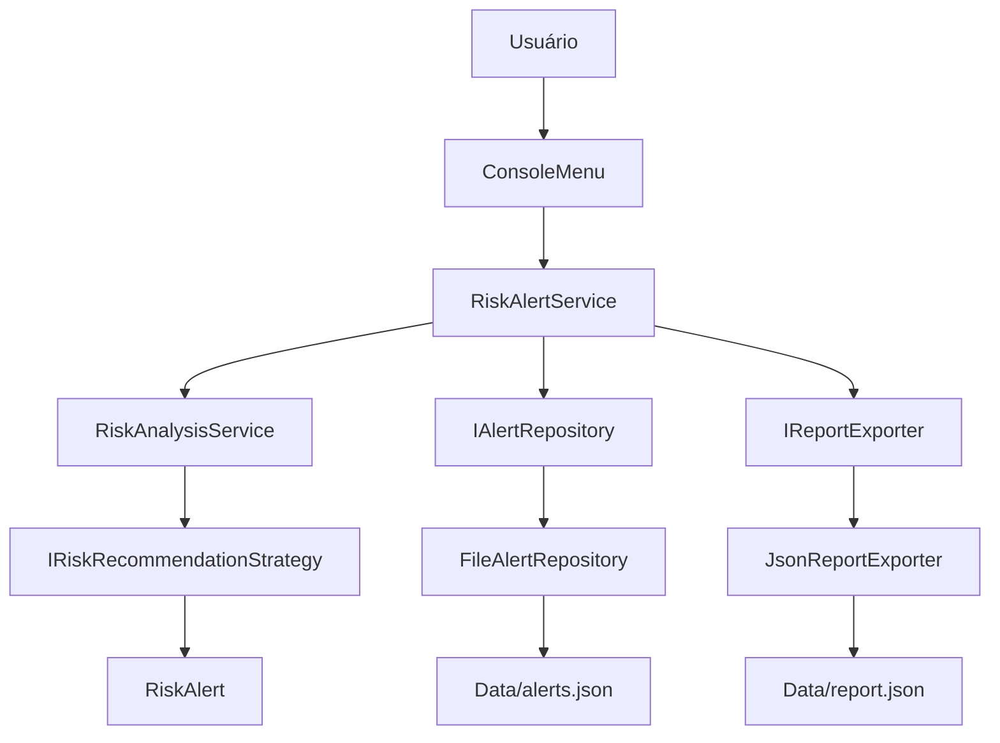
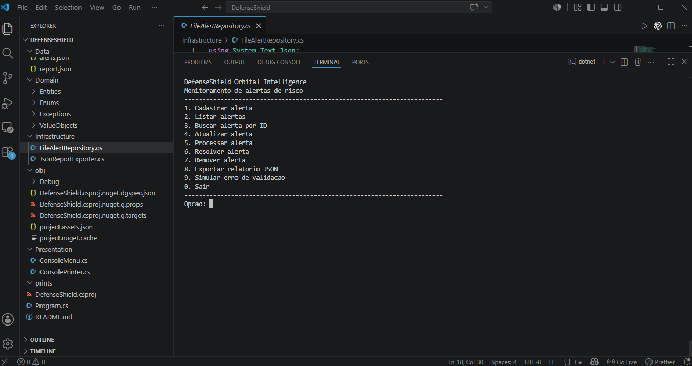
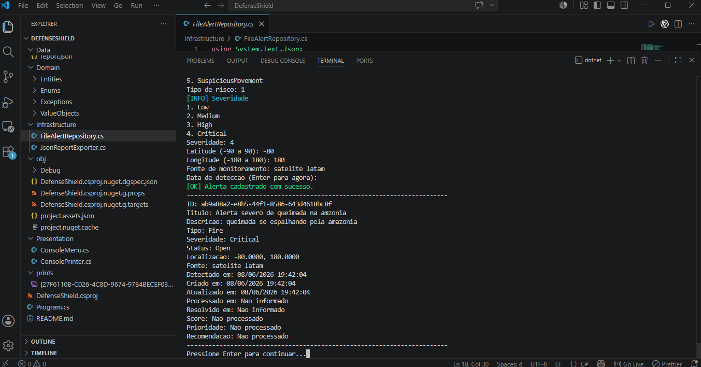
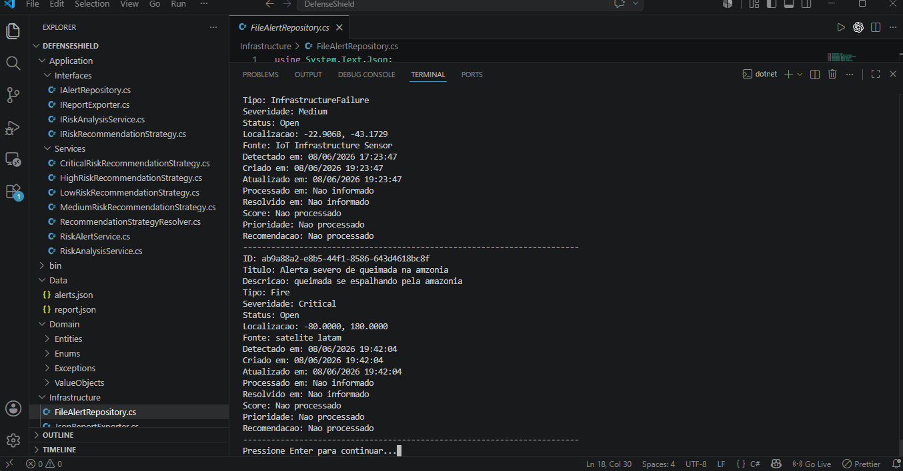
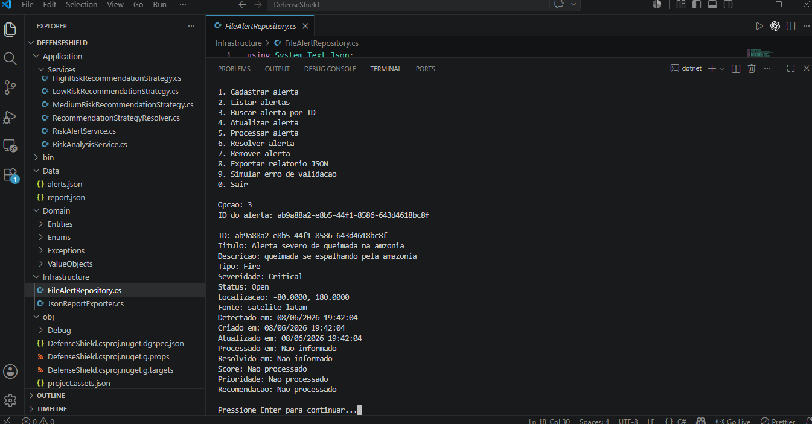
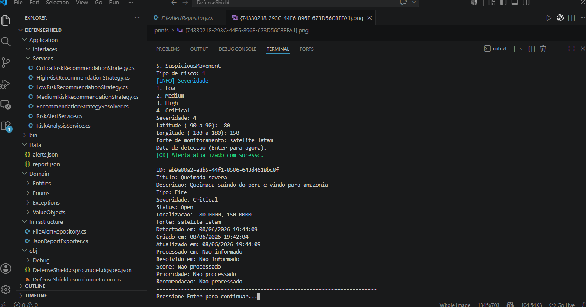
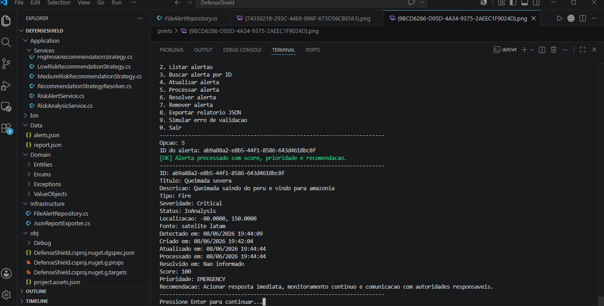
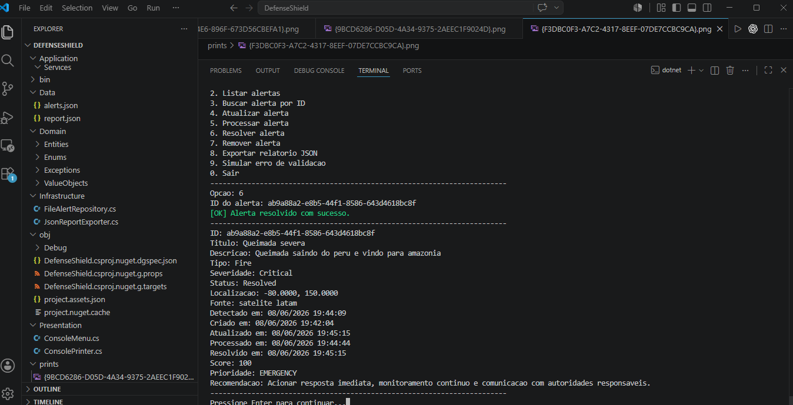
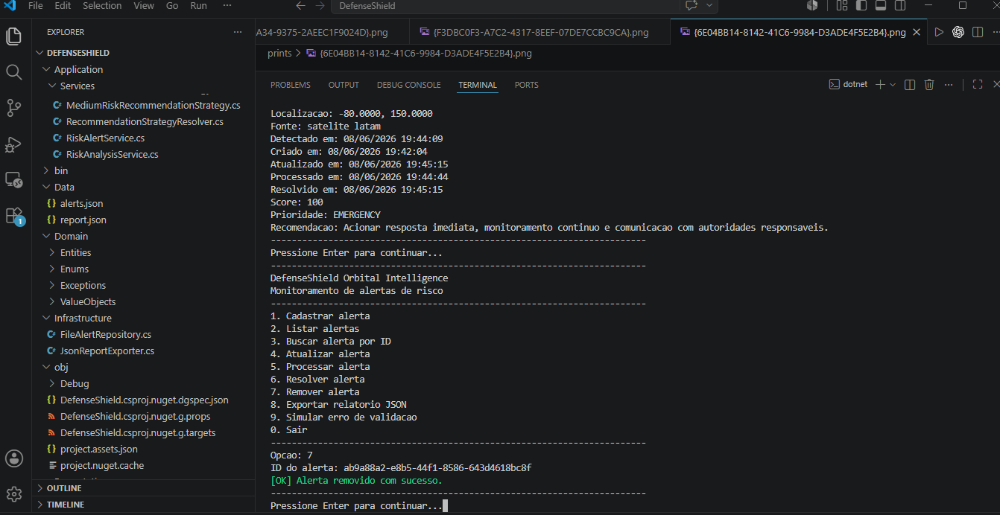

# DefenseShield Orbital Intelligence - C#

## Integrantes

- Lorenzo Hayashi Mangini
- Victorio Bastelli
- Vitor Bebiano
- Milton Cezar Bacanieski

## Descrição do projeto

DefenseShield Orbital Intelligence é uma aplicação Console em C#/.NET 10.0 que simula o monitoramento de alertas de risco detectados por satélites, sensores IoT e sistemas de monitoramento territorial.

O projeto foi construído para demonstrar Programação Orientada a Objetos com classes, herança, polimorfismo, interfaces, injeção de dependência manual, tratamento de exceções, structs, partial classes, manipulação de datas e persistência em arquivos JSON.

## Problema resolvido

O sistema centraliza alertas de risco relacionados a queimadas, enchentes, desmatamento, falhas em infraestrutura crítica e movimentações suspeitas. A aplicação permite cadastrar, listar, buscar, atualizar, processar, resolver, remover e exportar alertas.

## Relação com Space Connect

O tema Space Connect aparece na simulação de uma inteligência orbital que recebe dados de satélites e sensores terrestres. Esses dados são transformados em alertas com score de risco, prioridade e recomendação operacional.

## Funcionalidades

- Cadastrar alertas de risco.
- Listar todos os alertas.
- Buscar alerta por ID.
- Atualizar dados do alerta.
- Processar alerta com score, prioridade e recomendação.
- Resolver alerta.
- Remover alerta.
- Exportar relatório JSON.
- Simular erro de validação.
- Persistir alertas em `Data/alerts.json`.

## Como rodar

Execute os comandos abaixo na raiz do projeto:

```bash
dotnet build
dotnet run
```

## Estrutura de pastas

```text
Application/
  Interfaces/
  Services/
Domain/
  Entities/
  Enums/
  Exceptions/
  ValueObjects/
Infrastructure/
Presentation/
Data/
Program.cs
README.md
```

## Requisitos técnicos atendidos

| Critério do professor            | Como foi atendido no projeto                                                                      |
| -------------------------------- | ------------------------------------------------------------------------------------------------- |
| Modelagem de Domínio & POO       | Entidade RiskAlert, enums, fontes de monitoramento, herança e polimorfismo.                       |
| Abstração e Interfaces           | Interfaces IAlertRepository, IRiskAnalysisService, IRiskRecommendationStrategy e IReportExporter. |
| Classes abstratas                | BaseEntity e MonitoringSource.                                                                    |
| Injeção de dependência           | Dependências configuradas manualmente no Program.cs via construtores.                             |
| Lógica de fluxo, métodos e datas | Menu interativo, serviços, métodos de domínio e uso de DateTime para histórico.                   |
| Tratamento de exceções           | AlertNotFoundException, InvalidAlertDataException e RepositoryException.                          |
| Structs                          | GeoCoordinate como readonly struct para latitude e longitude.                                     |
| Partial class                    | RiskAlert dividida entre propriedades e comportamentos.                                           |
| Organização                      | Separação em Application, Domain, Infrastructure, Presentation e Data.                            |
| Evidências de execução           | Prints adicionados na seção de evidências.                                                        |
| README                           | Documentação com motivação, execução, estrutura, POO, diagrama e evidências.                      |

## Explicação de POO

### Abstração

A classe abstrata `MonitoringSource` representa uma fonte genérica de monitoramento. As interfaces `IAlertRepository`, `IRiskAnalysisService`, `IRiskRecommendationStrategy` e `IReportExporter` definem contratos sem expor detalhes de implementação.

### Encapsulamento

`RiskAlert` possui propriedades com `private set`. O estado do alerta é alterado por métodos de domínio como `Update`, `ProcessAnalysis` e `Resolve`, evitando alterações diretas fora da entidade.

### Herança

`RiskAlert` herda de `BaseEntity`, recebendo `Id`, `CreatedAt`, `UpdatedAt` e o método `Touch`. `SatelliteSource` e `SensorSource` herdam de `MonitoringSource`.

### Polimorfismo

`SatelliteSource` e `SensorSource` sobrescrevem `GetSourceType`. As estratégias `LowRiskRecommendationStrategy`, `MediumRiskRecommendationStrategy`, `HighRiskRecommendationStrategy` e `CriticalRiskRecommendationStrategy` implementam o mesmo contrato e geram comportamentos diferentes conforme a severidade.

## Interfaces e injeção de dependência

As dependências são configuradas manualmente no `Program.cs`, sem container externo. `RiskAlertService` recebe repositório, serviço de análise e exportador pelo construtor. `RiskAnalysisService` recebe uma lista de estratégias e usa `RecommendationStrategyResolver` para escolher a estratégia correta.

## Uso de DateTime

O projeto usa `DateTime` para registrar criação, atualização, detecção, processamento e resolução dos alertas. As datas são exibidas no console no formato `dd/MM/yyyy HH:mm:ss`.

## Tratamento de exceções

Foram criadas exceções específicas:

- `AlertNotFoundException`
- `InvalidAlertDataException`
- `RepositoryException`

O menu captura essas exceções e exibe mensagens amigáveis sem encerrar o programa.

## Uso de struct

`GeoCoordinate` é um `readonly struct` usado para latitude e longitude. Ele valida latitude entre -90 e 90 e longitude entre -180 e 180.

## Uso de partial class

`RiskAlert` foi dividido em dois arquivos:

- `RiskAlert.cs`: propriedades, construtores e validação inicial.
- `RiskAlert.Behaviors.cs`: comportamentos de atualização, processamento, resolução e validação.

## Manipulação de arquivos JSON

`FileAlertRepository` usa `System.Text.Json` para ler e salvar alertas em `Data/alerts.json`. Se o arquivo não existir ou estiver vazio, ele cria três alertas iniciais. `JsonReportExporter` exporta o relatório em `Data/report.json` com JSON indentado.

## Diagrama de fluxo



## Evidências de execução

### Evidência 01 - Menu principal e estrutura do projeto

Descrição: O print mostra a aplicação em execução no terminal com o menu principal de operações. Também é possível visualizar a organização do projeto no VS Code, incluindo as pastas `Data`, `Domain`, `Infrastructure`, `Presentation` e `prints`.

<p align="center">
  
</p>

### Evidência 02 - Cadastro de alerta

Descrição: O print mostra o fluxo de cadastro de um alerta crítico, com preenchimento de tipo, severidade, latitude, longitude, fonte e data de detecção. A aplicação confirma a criação do alerta e exibe os dados registrados no terminal.

<p align="center">
  
</p>

### Evidência 03 - Listagem de alertas

Descrição: O print mostra a listagem de alertas no terminal, incluindo informações como ID, título, descrição, tipo, severidade, status, localização, fonte e datas. A evidência demonstra a consulta dos registros carregados pela aplicação.

<p align="center">
  
</p>

### Evidência 04 - Busca por ID

Descrição: O print mostra a opção de busca por ID, com um GUID informado pelo usuário. A aplicação localiza o alerta correspondente e exibe seus dados detalhados no console.

<p align="center">
  
</p>

### Evidência 05 - Atualização de alerta

Descrição: O print mostra a atualização de um alerta existente e a confirmação de sucesso no terminal. Os dados exibidos indicam que campos como título, descrição, localização, fonte e data de atualização foram alterados.

<p align="center">
  
</p>

### Evidência 06 - Processamento de alerta

Descrição: O print mostra o processamento de um alerta, com geração de score de risco, prioridade e recomendação operacional. O status do alerta passa para análise e os dados calculados são exibidos no console.

<p align="center">
  
</p>

### Evidência 07 - Resolução de alerta

Descrição: O print mostra a resolução de um alerta pelo menu da aplicação. A saída confirma a operação e exibe o alerta com status `Resolved`, data de resolução, score, prioridade e recomendação.

<p align="center">
  
</p>

### Evidência 08 - Remoção de alerta

Descrição: O print mostra a remoção de um alerta pelo ID informado. A aplicação confirma que o alerta foi removido com sucesso no terminal.

<p align="center">
  
</p>

## Conclusão

O DefenseShield Orbital Intelligence entrega uma aplicação Console organizada e didática, com foco nos principais conceitos de C# solicitados para o trabalho. O projeto demonstra Programação Orientada a Objetos, herança, polimorfismo, interfaces, injeção de dependência manual, uso de `struct`, `partial class`, tratamento de exceções, `DateTime`, manipulação de arquivos JSON, separação em camadas e evidências reais de execução.
